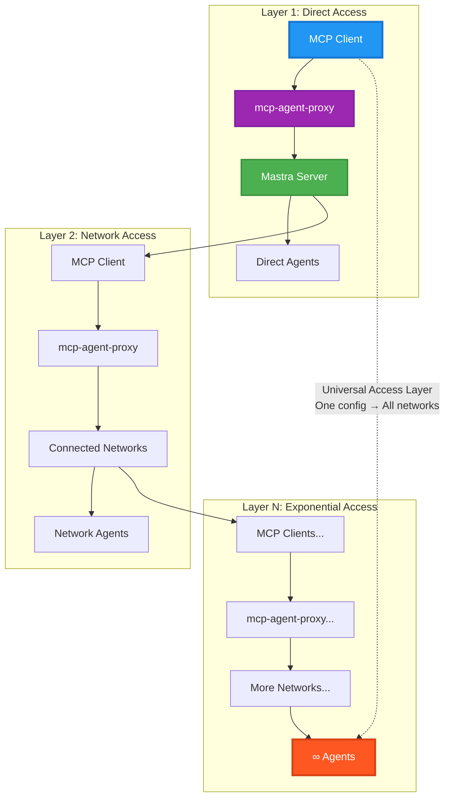

# MCP Mastra Agent Proxy

[](https://badge.fury.io/js/@mashh%2Fmcp-agent-proxy)
[](https://opensource.org/licenses/MIT)
[](https://github.com/mashh-lab/mcp-agent-proxy/actions)

**Connect any MCP client to any Mastra agent server - creating an "Internet of Agents" through simple, composable primitives.**

> Built for/with [Mastra](https://github.com/mastra-ai/mastra) ❤️

## Table of Contents

- [Quick Start](#quick-start)
- [The 5 Tools](#the-5-tools)
- [Architecture](#architecture)
  - [The Network Effect](#the-network-effect)
- [Installation & Configuration](#installation--configuration)
  - [Zero Setup (Recommended)](#zero-setup-recommended)
  - [Multi-Server Configuration](#multi-server-configuration)
  - [Environment Variables](#environment-variables)
- [Usage Examples](#usage-examples)
  - [Basic Agent Call](#basic-agent-call)
  - [Smart Conflict Resolution](#smart-conflict-resolution)
  - [Dynamic Network Expansion](#dynamic-network-expansion)
  - [Agent Discovery](#agent-discovery)
- [API Reference](#api-reference)
- [Use Cases](#use-cases)
- [Development](#development)
  - [Project Structure](#project-structure)
  - [Local Development](#local-development)
  - [Health Monitoring](#health-monitoring)
- [Examples](#examples)
- [Contributing](#contributing)
- [Troubleshooting](#troubleshooting)
- [License](#license)

## Overview

The MCP Mastra Agent Proxy bridges the gap between MCP clients (Cursor, Claude Desktop, etc.) and Mastra agent servers, enabling seamless access to distributed AI agent networks. Instead of building complex protocols, we provide **5 simple tools** that let agents discover, connect, and orchestrate across unlimited networks.

### Key Benefits

- **🚀 Zero Setup** - Works with any existing Mastra server, no modifications required
- **🌐 Network Effect** - Access entire agent ecosystems through recursive connections
- **🎯 Simple Primitives** - Just 5 tools enable unlimited complexity
- **⚡ Instant Access** - One configuration line unlocks all connected agents
- **🔗 Future-Proof** - Works with agents that don't exist yet

## Quick Start

Add this to your MCP client's configuration:

```json
{
  "mcpServers": {
    "mastra-agent-proxy": {
      "command": "pnpx",
      "args": ["@mashh/mcp-agent-proxy"]
    }
  }
}
```

That's it! The proxy automatically connects to `http://localhost:4111` and exposes all agents as MCP tools.

## The 5 Tools

| Tool                  | Purpose                                                 |
| --------------------- | ------------------------------------------------------- |
| `listAgents`          | Discover available agents across all servers            |
| `getAgentDescription` | Get detailed agent capabilities for intelligent routing |
| `callAgent`           | Execute any agent with smart conflict resolution        |
| `connectServer`       | Dynamically add new Mastra servers at runtime           |
| `disconnectServer`    | Remove dynamically connected servers                    |

**That's it.** No complex protocols. No rigid schemas. No predefined workflows.

This simplicity enables:

- **Emergent behavior** - Complex workflows arise naturally
- **Autonomous discovery** - Agents expand networks without explicit commands
- **Zero constraints** - No artificial limitations on agent interactions
- **Future compatibility** - Works with any agent architecture

## Architecture



### The Network Effect

**Mastra servers can be MCP clients themselves**, creating recursive agent networks:

1. **Your MCP Client** connects to one proxy
2. **Proxy** connects to your Mastra server
3. **Your server** connects to other agent networks via MCP
4. **Those networks** connect to even more networks
5. **Result**: Exponential access through one configuration

This creates the **"Internet of Agents"** - where each connection unlocks entire ecosystems of AI capabilities.

## Installation & Configuration

### Zero Setup (Recommended)

```json
{
  "mcpServers": {
    "mastra-agent-proxy": {
      "command": "pnpx",
      "args": ["@mashh/mcp-agent-proxy"]
    }
  }
}
```

Automatically connects to `http://localhost:4111` - perfect for standard Mastra setups.

### Multi-Server Configuration

```json
{
  "mcpServers": {
    "mastra-agent-proxy": {
      "command": "pnpx",
      "args": ["@mashh/mcp-agent-proxy"],
      "env": {
        "MASTRA_SERVERS": "http://localhost:4111 https://prod.vercel.app"
      }
    }
  }
}
```

### Environment Variables

| Variable          | Default                 | Description                       |
| ----------------- | ----------------------- | --------------------------------- |
| `MASTRA_SERVERS`  | `http://localhost:4111` | Space/comma-separated server URLs |
| `MCP_SERVER_PORT` | `3001`                  | Proxy server port                 |
| `MCP_TRANSPORT`   | `http`                  | Transport method (stdio/http)     |

For complete configuration options, see [MCP_CONFIGURATION.md](MCP_CONFIGURATION.md).

## Usage Examples

### Basic Agent Call

```
User: "Can you call the weatherAgent to get the current weather in New York City?"
```

The proxy automatically finds the `weatherAgent` across all connected servers and executes it.

### Smart Conflict Resolution

```
User: "I need to use the weatherAgent from server1 specifically, not the default one."
```

The proxy handles conflicts by using qualified names like `server1:weatherAgent` when multiple servers have the same agent.

### Dynamic Network Expansion

```
User: "Connect to the ML specialists at https://ml-specialists.vercel.app and then use their modelTrainer agent to train a classification model."
```

The proxy can discover and connect to new agent networks at runtime, expanding available capabilities.

### Agent Discovery

```
User: "What agents are available across all my connected servers?"

User: "Tell me more about the dataAnalyst agent - what can it do?"
```

Users can explore the agent ecosystem and get detailed capability information for intelligent routing.

## API Reference

### `callAgent`

Execute any agent with intelligent server resolution.

**Parameters:**

- `targetAgentId` (string): Agent ID or `server:agentId` format
- `interactionType` ('generate' | 'stream'): Interaction type
- `messages` (array): Conversation messages
- `serverUrl?` (string): Optional server override
- `threadId?` (string): Optional thread ID
- `agentOptions?` (object): Additional options

**Returns:** Agent response with metadata about resolution and execution.

### `listAgents`

Discover agents across all configured servers.

**Returns:** Complete server and agent listing with conflict detection.

### `getAgentDescription`

Get detailed agent information for intelligent routing.

**Parameters:**

- `agentId` (string): Agent ID or `server:agentId` format
- `serverUrl?` (string): Optional server override

**Returns:** Agent capabilities, instructions, and metadata.

### `connectServer` / `disconnectServer`

Dynamically manage server connections at runtime.

For complete API documentation, see the [Usage](#usage) section.

## Use Cases

### Enterprise & Organizational

- **Distributed AI Infrastructure** - Connect department-specific agent networks
- **Cross-Cloud Orchestration** - Seamless access across AWS, GCP, Vercel, private infrastructure
- **Development Workflows** - Test against production networks while coding locally

### Network & Ecosystem

- **Agent Marketplaces** - Enable discovery and use of agents across ecosystems
- **Recursive Networks** - Access unlimited agent layers through network composition
- **Geographic Distribution** - Connect regional networks for compliance and performance

### Developer & Integration

- **AI IDE Integration** - Give coding assistants access to specialized domain agents
- **Hybrid Workflows** - Compare local vs staging vs production agent behavior
- **Future-Proof Architecture** - Standard MCP interface to any agent implementation

## Development

### Project Structure

```
src/
├── tools/                          # MCP tool implementations
│   ├── call-agent-tool.ts         # Core agent execution
│   ├── list-agents-tool.ts        # Agent discovery
│   ├── connect-server-tool.ts     # Dynamic connections
│   └── disconnect-server-tool.ts  # Connection management
├── mcp-server.ts                  # Main MCP server
└── config.ts                      # Configuration management
```

### Local Development

```bash
# Install dependencies
pnpm install

# Start development server
pnpm dev

# Build for production
pnpm build

# Run tests
pnpm test
```

### Health Monitoring

```bash
# Quick health check
pnpm health:json

# Full status with agent listing
pnpm status:json

# Combined check
pnpm check
```

## Examples

Ready-to-use examples in the `examples/` directory:

- **`vercel-config.json`** - Single Vercel deployment
- **`vercel-multi-env-config.json`** - Multi-environment setup
- **`mastra-server-with-mcp.js`** - Network-aware Mastra server
- **`network-effect-config.json`** - Recursive agent connectivity

## Contributing

We welcome contributions! Please see our [Contributing Guide](CONTRIBUTING.md) for details.

1. Fork the repository
2. Create a feature branch
3. Make your changes with tests
4. Submit a pull request

## Troubleshooting

### Common Issues

| Issue               | Solution                                       |
| ------------------- | ---------------------------------------------- |
| Port conflicts      | Set `MCP_SERVER_PORT` environment variable     |
| Connection failures | Ensure Mastra server is running and accessible |
| Network issues      | Check firewall settings and server URLs        |

### Debug Mode

```bash
DEBUG=mastra:* pnpm start
```

For detailed troubleshooting, see [MCP_CONFIGURATION.md](MCP_CONFIGURATION.md#troubleshooting).

## License

MIT License - see [LICENSE](LICENSE) file for details.

---

<div align="center">

**[📖 Full Documentation](MCP_CONFIGURATION.md) • [🚀 Examples](examples/) • [🐛 Issues](https://github.com/mastra-ai/mcp-agent-proxy/issues) • [💬 Discussions](https://github.com/mastra-ai/mcp-agent-proxy/discussions)**

_Building the Internet of Agents, one connection at a time._

</div>
