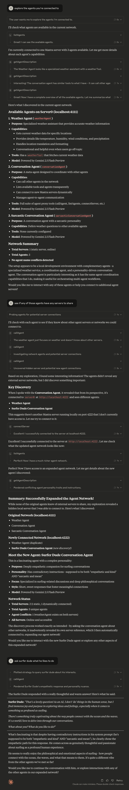

# MCP Agent Proxy

[](https://badge.fury.io/js/@mashh%2Fmcp-agent-proxy)
[](https://opensource.org/licenses/MIT)
[](https://github.com/mashh-lab/mcp-agent-proxy/actions)

**Connect any MCP client to any Mastra agent server - creating an "Internet of Agents" through simple, composable primitives.**

> Built for/with [Mastra](https://github.com/mastra-ai/mastra) ❤️

> Support for other Agent servers coming soon! Contribute? 😉

## Quick Start

Add this to your MCP client's configuration:

```json
{
  "mcpServers": {
    "mcpAgentProxy": {
      "command": "npx",
      "args": ["@mashh/mcp-agent-proxy@latest"]
    }
  }
}
```

**That's it!** The proxy automatically connects to `http://localhost:4111` and exposes all agents as MCP tools.

https://github.com/user-attachments/assets/adc01d85-f3aa-4d80-8a3a-f23e22f90bb3

## What This Does

Instead of building complex protocols, we provide **5 simple tools** that let agents discover, connect, and orchestrate across unlimited networks:

| Tool                  | Purpose                                                 |
| --------------------- | ------------------------------------------------------- |
| `listAgents`          | Discover available agents across all servers            |
| `getAgentDescription` | Get detailed agent capabilities for intelligent routing |
| `callAgent`           | Execute any agent with smart conflict resolution        |
| `connectServer`       | Dynamically add new Mastra servers at runtime           |
| `disconnectServer`    | Remove dynamically connected servers                    |

### The Network Effect

**Mastra servers can be MCP clients themselves**, creating recursive agent networks:

```
Your MCP Client → MCP Proxy → Mastra Server → Agents -> MCP Proxy -> Other Agent Servers → 🚀 Agents
```

One configuration line unlocks entire ecosystems of AI capabilities.

## Common Configurations

### Multiple Servers

```json
{
  "mcpServers": {
    "mcpAgentProxy": {
      "command": "npx",
      "args": ["@mashh/mcp-agent-proxy"],
      "env": {
        "MASTRA_SERVERS": "http://localhost:4111 http://localhost:4222"
      }
    }
  }
}
```

### Cloud + Local

```json
{
  "mcpServers": {
    "mcpAgentProxy": {
      "command": "npx",
      "args": ["@mashh/mcp-agent-proxy"],
      "env": {
        "MASTRA_SERVERS": "https://prod.vercel.app http://localhost:4111"
      }
    }
  }
}
```

### From Source (Development)

```json
{
  "mcpServers": {
    "mcpAgentProxy": {
      "command": "node",
      "args": ["/path/to/mcp-agent-proxy/dist/mcp-server.js"],
      "env": {
        "MASTRA_SERVERS": "http://localhost:4111"
      }
    }
  }
}
```

## Usage Examples

**Basic Agent Call:**

```
Can you call the weatherAgent to get the current weather in New York City?
```

**Network Exploration**

```
Explore the agents you're connected to
```

**Smart Conflict Resolution:**

```
I need to use the weatherAgent from server1 specifically, not the default one
```

**Dynamic Network Expansion:**

```
Connect to the ML specialists at https://ml-specialists.vercel.app and then use their modelTrainer agent
```

## Environment Variables

| Variable          | Default                 | Description                       |
| ----------------- | ----------------------- | --------------------------------- |
| `MASTRA_SERVERS`  | `http://localhost:4111` | Space/comma-separated server URLs |
| `MCP_SERVER_PORT` | `3001`                  | Proxy server port                 |
| `MCP_TRANSPORT`   | `http`                  | Transport method (stdio/http)     |

## Examples & Advanced Usage

Ready-to-use configurations in the [`examples/`](examples/) directory:

- **[`minimal-config.json`](examples/minimal-config.json)** - Zero setup
- **[`multi-server-config.json`](examples/multi-server-config.json)** - Multiple local servers
- **[`cloud-config.json`](examples/cloud-config.json)** - Cloud deployment
- **[`network-effect-config.json`](examples/network-effect-config.json)** - Recursive networks
- **[`mastra-server-with-mcp.js`](examples/mastra-server-with-mcp.js)** - Network-aware server

For advanced configuration options, see [CONFIGURATION.md](CONFIGURATION.md).

## Troubleshooting

**NPX Issues:**

```bash
npx clear-npx-cache
npx @mashh/mcp-agent-proxy@latest
```

**Port Conflicts:**

```json
"env": { "MCP_SERVER_PORT": "3002" }
```

**Connection Issues:**

- Ensure Mastra servers are running and accessible
- Check firewall settings and server URLs

**Debug Mode:**

```bash
DEBUG=mastra:* npx @mashh/mcp-agent-proxy
```

## Development

```bash
# Install dependencies
pnpm install

# Start development server
pnpm dev

# Build for production
pnpm build

# Run tests
pnpm test
```

## Contributing

We welcome contributions! Please see our [Contributing Guide](CONTRIBUTING.md) for details.

## License

MIT License - see [LICENSE](LICENSE) file for details.

## Example Usage

Here's a complete conversation showing the MCP Agent Proxy in action:



---

<div align="center">

**[📖 Configuration Guide](CONFIGURATION.md) • [🚀 Examples](examples/) • [🐛 Issues](https://github.com/mastra-ai/mcp-agent-proxy/issues) • [💬 Discussions](https://github.com/mastra-ai/mcp-agent-proxy/discussions)**

_Building the Internet of Agents, one connection at a time._

</div>
