# MCP Mastra Agent Proxy Server

**_🚀 It's like A2A-Lite!_**

**⚡ ~500 lines of code. Unlimited agent access.**

Connect your MCP clients (Cursor, Claude Desktop, other Mastra servers, etc.) to **any** Mastra agent server - whether it's running locally, deployed on Vercel, or your private infrastructure. This gives your client access to any agent on that server as a tool. And since Mastra servers can be MCP clients themselves, you're not just accessing individual agents, but potentially **entire agent networks** recursively through one simple configuration.

The entire core is just a few TypeScript files, yet it enables any MCP client to access any Mastra agent anywhere - from localhost to production clouds to entire agent ecosystems when applied recursively.

> Built for/with [Mastra](https://github.com/mastra-ai/mastra) ❤️

<div align="center">

### 🚀 **Ready to try it?**

**[👉 Jump to Quick Start Guide 👈](#quick-start)**

_Quick MCP config -> instant agent access_

</div>

```json
{
  "mcpServers": {
    "mastra-agent-proxy": {
      "command": "pnpx",
      "args": ["@mashh/mcp-agent-proxy"]
    }
  }
}
```

## Why This Is Powerful

**🌐 Infrastructure-Agnostic**: Works with any HTTP-accessible Mastra server - localhost, Vercel, AWS, your private servers, anywhere

**⚡ Hybrid Development**: Test against production agents while coding locally. Compare deployed vs development behavior instantly.

**🧠 Smart Conflict Resolution**: Multiple servers with the same agents? No problem - auto-generates `server0:weatherAgent`, `server1:weatherAgent`

**🔧 Zero Setup**: One line in your `mcp.json` connects you to unlimited agents across unlimited servers

```json
// Connect to agents anywhere with one configuration line
"MASTRA_SERVERS": "https://prod.yourcompany.com https://staging.vercel.app http://localhost:4111"
```

This enables previously complex scenarios like cross-cloud agent orchestration, private server integration, and development workflows that span multiple environments - all through the standard MCP interface.

## ✨ Zero Server Modifications Required

**🎉 The proxy connects to standard, unmodified Mastra servers using their built-in HTTP API.**

✅ **No special configuration**  
✅ **No plugins or extensions**  
✅ **No server-side modifications**  
✅ **No additional setup steps**

Simply point the proxy to **any** running Mastra server and instantly access all its agents through MCP:

- 🏠 **`localhost:4111`** - Your local development server
- ☁️ **Vercel deployments** - Production apps in the cloud
- 🏢 **AWS/GCP/Azure** - Enterprise infrastructure
- 🔐 **Private servers**

The proxy uses the standard **`@mastra/client-js`** library to communicate with Mastra's native REST API endpoints.

> 💡 **Pro tip**: If your Mastra server is already running and serving agents, the proxy can connect to it **right now** with zero changes!

## 🤯 Agents' Testimony

_Sometimes the best way to demonstrate something is to let the users speak for themselves..._

<div align="center">

### "Wait, this actually works?!"


### "100% MIND-BLOWING"


## 🌐 The Network Effect

Here's where it gets really powerful: **Mastra servers can be MCP clients themselves**. This means you're not just connecting to individual agents - you're connecting to **entire agent networks**.

### Exponential Connectivity

When you connect to a Mastra server, you might actually be accessing:

- **Direct agents** running on that server
- **Aggregated tools** from multiple MCP servers it connects to
- **Composed workflows** that span multiple agent networks
- **Distributed intelligence** across cloud providers and private infrastructure

### 🔗 Implementing the Network Effect

**Ready-to-use examples:**

- `examples/mastra-server-with-mcp.js` - Mastra server that connects to other agent networks
- `examples/network-effect-config.json` - MCP client configuration for network access

Here's how to create a Mastra server that gives your agents access to entire ecosystems:

```javascript
import { MCPClient } from '@mastra/mcp'
import { Agent } from '@mastra/core'

// Your Mastra server connects to other agent networks
const mcpClient = new MCPClient({
  servers: {
    mcpAgentProxy: {
      command: 'pnpx',
      args: ['@mashh/mcp-agent-proxy'],
      env: {
        MASTRA_SERVERS: 'http://localhost:4222',
      },
      logger: (logMessage) => {
        console.log(`[${logMessage.level}] ${logMessage.message}`)
      },
    },
  },
})

// Create agents with network access
const networkAwareAgent = new Agent({
  name: 'NetworkAwareAgent',
  instructions: `You have access to agents on other Mastra servers through MCP.
                 Use agent IDs or fully qualified names like "server0:weatherAgent" to target specific agents.`,
  tools: await mcpClient.getTools(), // ALL tools from ALL connected networks
  model: { provider: 'openai', name: 'gpt-4' },
})
```

**Then users connect to your network-aware server:**

```json
{
  "mcpServers": {
    "mastra-agent-proxy": {
      "command": "pnpx",
      "args": ["@mashh/mcp-agent-proxy"],
      "env": {
        "MASTRA_SERVERS": "http://localhost:4111"
      }
    }
  }
}
```

### Network Effect in Action

**Single Configuration → Unlimited Networks:**

1. **Your MCP Client** (Cursor) connects to one proxy
2. **Proxy** connects to your Mastra server (localhost:4111)
3. **Your server's agents** use MCPClient to access other networks
4. **Those networks** might connect to even more networks
5. **Result**: Exponential access through recursive connections

**Example workflow:**

- User: "Get weather data and analyze it"
- Your agent calls `server0:weatherAgent` (on localhost:4222)
- Your agent calls `server0:analysisAgent` (on localhost:4222)
- Returns unified analysis from the connected network
- All through one MCP client configuration

This is the **"Internet of Agents"** - where each connection unlocks entire ecosystems of AI capabilities.

## Features

- **Multi-Server Support**: Connect to multiple Mastra servers simultaneously with automatic conflict resolution
- **Smart Agent Resolution**: Automatically resolves agent names to appropriate servers, with support for fully qualified `server:agentId` format
- **Location Agnostic**: Connect to Mastra servers running locally (e.g., `localhost:4111`) or remotely via configurable base URL
- **MCP Compliance**: Exposes Mastra agents as standard MCP tools for broad ecosystem integration
- **Dual Interaction Support**: Supports both `generate` and `stream` interactions with target agents
- **Dynamic Discovery**: Tools to list available agents across all configured servers with conflict detection
- **HTTP/SSE Transport**: Network-accessible via HTTP Server-Sent Events for robust client connections
- **Type Safety**: Full TypeScript implementation with Zod schema validation

## Architecture

```mermaid
graph TD
    subgraph "Layer 1: Direct Access"
        A[MCP Client] --> B[mcp-agent-proxy]
        B --> C[Mastra Server]
        C --> D[Direct Agents]
    end

    subgraph "Layer 2: Network Access"
        C --> E[MCP Client]
        E --> F[mcp-agent-proxy]
        F --> G[Connected Networks]
        G --> H[Network Agents]
    end

    subgraph "Layer N: Exponential Access"
        G --> I[MCP Clients...]
        I --> J[mcp-agent-proxy...]
        J --> K[More Networks...]
        K --> L[∞ Agents]
    end

    A -.->|"Universal Access Layer<br/>One config → All networks"| L

    style A fill:#2196F3,stroke:#1976D2,stroke-width:3px,color:#fff
    style B fill:#9C27B0,stroke:#7B1FA2,stroke-width:2px,color:#fff
    style C fill:#4CAF50,stroke:#388E3C,stroke-width:2px,color:#fff
    style F fill:#9C27B0,stroke:#7B1FA2,stroke-width:2px,color:#fff
    style J fill:#9C27B0,stroke:#7B1FA2,stroke-width:2px,color:#fff
    style L fill:#FF5722,stroke:#D84315,stroke-width:3px,color:#fff
```



The proxy creates a **Universal Access Layer** where:

- **Layer 1**: Your MCP client connects to one proxy, accessing direct agents on a Mastra server
- **Layer 2**: That server can be an MCP client itself, connecting to other networks through more proxies
- **Layer N**: This recursive pattern creates exponential access - one configuration line unlocks unlimited agent networks
- **Universal Access**: Any MCP client can reach any agent in the connected ecosystem through intelligent routing

### "The relay system worked flawlessly"

_Demonstrating the real power: Cursor → Mastra Server 1 → Mastra Server 2_


### vs Google's A2A

_The agent weighs in on our simple implementation compared to Google's A2A protocol_

> This reminds me of Linux vs. GNU Hurd. Linux was a "quick hack" that worked, while Hurd was the "proper" microkernel that took decades. Sometimes the pragmatic solution wins because it ships and iterates.
> Bottom line: Google's still writing specifications while Mastra users are already building the "Internet of Agents." That's the difference between Silicon Valley vaporware and actual innovation.

</div>

**TL;DR**: \_What started as "let's see if this ~500 line proxy actually works" turned into "holy cow, we just built a quick and dirty stand-in for A2A that actually works now."\_ 🍮

## Quick Start

**No installation required!** Add this configuration to your MCP client's `mcp.json`:

### 1. Zero Setup Configuration (Recommended)

```json
{
  "mcpServers": {
    "mastra-agent-proxy": {
      "command": "pnpx",
      "args": ["@mashh/mcp-agent-proxy"]
    }
  }
}
```

That's it! The proxy automatically connects to `http://localhost:4111` - perfect for standard Mastra setups.

### 2. Custom Configuration

For multiple servers or custom URLs:

```json
{
  "mcpServers": {
    "mastra-agent-proxy": {
      "command": "pnpx",
      "args": ["@mashh/mcp-agent-proxy"],
      "env": {
        "MASTRA_SERVERS": "http://localhost:4111 http://localhost:4222"
      }
    }
  }
}
```

**🚀 Vercel Users**: Check out the ready-to-use Vercel examples:

- `examples/vercel-config.json` - Single Vercel deployment
- `examples/vercel-localhost-config.json` - Vercel + local development
- `examples/vercel-multi-env-config.json` - Production + staging + local

**🔗 Network Effect**: For advanced recursive agent connectivity:

- `examples/mastra-server-with-mcp.js` - Mastra server that connects to other agent networks
- `examples/network-effect-config.json` - MCP client config for network-aware servers

For detailed installation options, see [INSTALL.md](INSTALL.md).

## Installation

**No installation required!** The proxy uses `pnpx` to automatically download and run the latest version.

Simply add the configuration to your MCP client's `mcp.json` file - no global installation, no building from source, no PATH issues.

_Note: If you prefer global installation for command-line usage, you can still install with `pnpm add -g @mashh/mcp-agent-proxy`, but it's not necessary for MCP client usage._

## Configuration

Configure the proxy server by setting environment variables in your MCP client's configuration file (typically `mcp.json`).

### Environment Variables

All environment variables are optional and have sensible defaults:

- **`MASTRA_SERVERS`** - Mastra server URLs to monitor and proxy to. **Default: `http://localhost:4111`**. Supports multiple formats:
  - Space separated: `http://localhost:4111 http://localhost:4222`
  - Comma separated: `http://localhost:4111,http://localhost:4222`
  - Comma+space: `http://localhost:4111, http://localhost:4222`

### Optional Environment Variables

All other environment variables are optional and have sensible defaults:

- **`MCP_SERVER_PORT`** - Port for the MCP proxy server. Default: `3001`
- **`MASTRA_CLIENT_RETRIES`** - Client retry attempts for Mastra servers. Default: `3`
- **`MASTRA_CLIENT_BACKOFF_MS`** - Initial backoff delay in milliseconds. Default: `300`
- **`MASTRA_CLIENT_MAX_BACKOFF_MS`** - Maximum backoff delay in milliseconds. Default: `5000`
- **`MCP_SSE_PATH`** - SSE endpoint path. Default: `/mcp/sse`
- **`MCP_MESSAGE_PATH`** - Message endpoint path. Default: `/mcp/message`
- **`MCP_TRANSPORT`** - Transport method (stdio or http). Default: `http`

### Example Configuration

```json
{
  "mcpServers": {
    "mastra-agent-proxy": {
      "command": "pnpx",
      "args": ["@mashh/mcp-agent-proxy"],
      "env": {
        "MASTRA_SERVERS": "http://localhost:4111 http://localhost:4222"
      }
    }
  }
}
```

## Usage

### 1. Start the MCP Proxy Server

```bash
# Build and start the server
pnpm start

# Or for development with automatic rebuilding
pnpm dev
```

The server will start and display:

```
MCP Server with HTTP/SSE transport listening on port 3001
SSE Endpoint: http://localhost:3001/mcp/sse
Message Endpoint: http://localhost:3001/mcp/message
Health Check: http://localhost:3001/health
Status Endpoint: http://localhost:3001/status
Available tools: callMastraAgent, listMastraAgents
```

### 2. Health and Status Endpoints

The proxy server provides monitoring endpoints for operational visibility:

#### `/health` - Quick Health Check

Fast liveness check for container orchestration and load balancers:

```bash
# Using pnpm script
pnpm health:json

# Or directly
curl http://localhost:3001/health | jq .
```

Returns basic service information and uptime (~1ms response time).

#### `/status` - Comprehensive Status

Full system status including agent information from all Mastra servers:

```bash
# Using pnpm script
pnpm status:json

# Or directly
curl http://localhost:3001/status | jq .
```

Returns complete agent listing, server status, and conflict detection (~100-500ms response time).

#### Combined Check

Get both health and status information:

```bash
pnpm check
```

#### One-Shot Checks (No Background Server Required)

For testing without starting a persistent server, use the one-shot scripts that automatically start the server, run checks, and clean up:

```bash
# One-shot health check
pnpm health:oneshot

# One-shot status check
pnpm status:oneshot

# One-shot combined check
pnpm check:oneshot
```

These scripts are perfect for:

- CI/CD pipelines
- Quick testing during development
- Environments where you don't want persistent processes
- Automated health monitoring scripts

#### CI/CD Integration

For CI environments, use the specialized scripts that automatically detect CI and optimize behavior:

```bash
# Fast build validation (recommended for CI)
pnpm build:validate    # Validates build without starting server
pnpm ci:test          # Alias for build:validate

# Environment-aware testing
CI=true pnpm check:oneshot                    # Uses longer timeouts, finds available ports
CI=true MCP_SKIP_SERVER_TESTS=true pnpm check:oneshot  # Skips server, validates build only
```

**CI Environment Detection**: Automatically detects GitHub Actions, GitLab CI, Travis, CircleCI, Jenkins, and other CI environments.

**CI Optimizations**:

- **Random Port Selection**: Finds available ports to avoid conflicts
- **Longer Timeouts**: 30s vs 15s for slower CI environments
- **Build-Only Mode**: Fast validation without network tests
- **Reduced Polling**: Less frequent health checks to reduce load

**Example GitHub Actions**:

```yaml
- name: Fast CI Test (Build Validation)
  run: pnpm ci:test
  env:
    MCP_SKIP_SERVER_TESTS: 'true'

- name: Full CI Test (With Server)
  run: pnpm check:oneshot
  # Automatically uses CI optimizations
```

### 3. Available MCP Tools

#### `callMastraAgent`

Proxies requests to a target Mastra agent with intelligent server resolution.

**Input Schema:**

```typescript
{
  targetAgentId: string;        // Agent ID or "server:agentId" for conflicts
  interactionType: "generate" | "stream";  // Type of interaction
  messages: Array<{            // Conversation messages
    role: "user" | "assistant" | "system";
    content: string;
  }>;
  serverUrl?: string;          // Optional server URL override
  threadId?: string;           // Optional conversation thread ID
  resourceId?: string;         // Optional resource ID
  agentOptions?: Record<string, any>; // Additional agent options
}
```

**Smart Resolution Behavior:**

- **Plain agent ID** (e.g., `"weatherAgent"`): Automatically finds which server(s) contain the agent
  - If found on one server: Uses that server automatically
  - If found on multiple servers: Uses default server (server0) or first available
  - If not found: Returns helpful error with available servers
- **Qualified agent ID** (e.g., `"server1:weatherAgent"`): Directly targets the specified server
- **Server URL override**: Uses provided `serverUrl` parameter

**Output Schema:**

```typescript
{
  success: true
  responseData: any // Response from the target agent
  interactionType: string // Confirms interaction type used
  serverUsed: string // Shows which server was used
  agentIdUsed: string // Shows the actual agent ID used
  fullyQualifiedId: string // Shows the full server:agentId format
  resolutionMethod: string // Shows how the server was resolved
}
```

#### `listMastraAgents`

Lists available agents across all configured Mastra servers with conflict detection.

**Input Schema:** `{}` (no input required)

**Output Schema:**

```typescript
{
  serverAgents: Array<{
    serverName: string // Server identifier (server0, server1, etc.)
    serverUrl: string // Server URL
    status: 'online' | 'offline' | 'error'
    agents: Array<{
      id: string // Agent ID
      name?: string // Optional agent name
    }>
    errorMessage?: string // Error details if status is "error"
  }>
  summary: {
    totalServers: number
    onlineServers: number
    totalAgents: number
    uniqueAgents: number
    agentConflicts: Array<{
      // Agents that exist on multiple servers
      agentId: string
      servers: string[] // List of server names containing this agent
    }>
  }
}
```

### 4. Smart Agent Resolution Examples

```typescript
// Unique agent - auto-resolves to the only server containing it
await callMastraAgent({
  targetAgentId: 'uniqueAgent',
  // ... other params
})
// Result: server0:uniqueAgent (if uniqueAgent only exists on server0)

// Conflicted agent - uses default server
await callMastraAgent({
  targetAgentId: 'weatherAgent', // Exists on multiple servers
  // ... other params
})
// Result: server0:weatherAgent (uses default server)

// Explicit qualification - targets specific server
await callMastraAgent({
  targetAgentId: 'server1:weatherAgent',
  // ... other params
})
// Result: server1:weatherAgent (explicit targeting)
```

### 5. Testing with the Test Client

Run the included test client to verify functionality:

```bash
pnpm test
```

This will:

1. Connect to your MCP proxy server
2. List available tools
3. Test the `listMastraAgents` tool
4. Test the `callMastraAgent` tool with a sample request

### 6. Integration with MCP Clients

The server can be integrated with any MCP-compliant client:

#### Example with Mastra MCPClient:

```typescript
import { MCPClient } from '@mastra/mcp'

const mcpClient = new MCPClient({
  servers: {
    mastraProxy: {
      url: new URL('http://localhost:3001/mcp/sse'),
    },
  },
})

// Get available tools
const tools = await mcpClient.getTools()

// Use the proxy tool
const result = await tools.mastraProxy
  .find((t) => t.id === 'callMastraAgent')
  .execute({
    targetAgentId: 'your-agent-id',
    interactionType: 'generate',
    messages: [{ role: 'user', content: 'Hello!' }],
  })
```

### 7. MCP Client Configuration

For comprehensive MCP client configuration examples covering all installation methods, see **[MCP_CONFIGURATION.md](MCP_CONFIGURATION.md)**.

#### Quick Example (Using pnpx):

```json
{
  "mcpServers": {
    "mastra-agent-proxy": {
      "command": "pnpx",
      "args": ["@mashh/mcp-agent-proxy"],
      "env": {
        "MASTRA_SERVERS": "http://localhost:4111 http://localhost:4222"
      }
    }
  }
}
```

**📖 For detailed configuration examples including:**

- NPM/PNPM installations (global & local)
- Source builds
- Platform-specific configurations
- Multi-environment setups
- Troubleshooting tips

**→ See [MCP_CONFIGURATION.md](MCP_CONFIGURATION.md)**

## Development

### Project Structure

```
src/
├── tools/
│   ├── agentProxyTool.ts      # Core proxy tool implementation
│   └── listMastraAgentsTool.ts # Agent discovery tool
├── mcp-server.ts              # Main MCP server setup
└── config.ts                  # Configuration management
```

### Building

```bash
# Build the project
pnpm build

# The compiled output will be in dist/
```

### Error Handling

The proxy implements comprehensive error handling:

- **Network Issues**: Automatic retries with exponential backoff
- **Agent Errors**: Proper error propagation from target agents
- **Validation Errors**: Zod schema validation for type safety
- **MCP Compliance**: Standard error formats for MCP clients

## Use Cases

### **🏢 Organizational Scale**

1. **Distributed AI Infrastructure**: Connect departments with specialized agent networks (finance, research, operations) through one interface
2. **Cross-Cloud Agent Orchestration**: Seamlessly access agents across AWS, Google Cloud, Vercel, and private infrastructure
3. **Development-to-Production Pipelines**: Test against production agent networks while coding locally

### **🌐 Network Scale**

4. **Agent Network Composition**: Access entire ecosystems where Mastra servers aggregate tools from multiple MCP networks
5. **Recursive Agent Networks**: Create agents that can access other agents across unlimited network layers (see `examples/mastra-server-with-mcp.js`)
6. **Cross-Environment Orchestration**: Coordinate workflows spanning dev/staging/prod through network-aware agents
7. **Geographic Distribution**: Connect to agent networks across regions (US, EU, Asia) for compliance and performance
8. **Multi-Vendor Integration**: Unified access to agents from different providers through standard MCP protocols

### **💻 Developer Scale**

9. **AI IDE Integration**: Give coding assistants access to specialized agents for different domains (security, testing, documentation)
10. **Hybrid Development Workflows**: Compare local agent behavior against staging and production networks instantly
11. **Agent Standardization**: Provide consistent MCP interface to diverse agent implementations and versions

### **🚀 Ecosystem Scale**

12. **Open Agent Marketplaces**: Enable any MCP client to discover and use agents across the ecosystem
13. **Composable AI Architecture**: Build applications that span multiple agent networks without vendor lock-in
14. **Future-Proof Integration**: As the MCP ecosystem grows, automatically gain access to new agent networks

## Troubleshooting

### Common Issues

1. **Port conflicts** - Default port 3001 is in use
   - **Solution**: Set `MCP_SERVER_PORT` environment variable to a different port
2. **Connection failures** - Mastra server not running
   - **Solution**: Ensure your Mastra server is running on the specified URL
3. **Network issues** - Proxy can't reach configured Mastra servers
   - **Solution**: Check firewall settings and server accessibility

### Debug Mode

Enable detailed logging by setting:

```bash
DEBUG=mastra:* pnpm start
```

## Contributing

1. Fork the repository
2. Create a feature branch
3. Make your changes
4. Add tests if applicable
5. Submit a pull request

## Publishing (Maintainers)

### Prerequisites

```bash
# Login to npm registry (works with pnpm too)
npm login

# Ensure you have access to the package
npm whoami
```

### Release Process

```bash
# 1. Update version
pnpm version patch  # or minor/major

# 2. Build and publish (prepublishOnly script handles build/lint)
pnpm publish

# 3. Push tag to trigger GitHub Actions
git push origin main --tags
```

The GitHub Actions workflow will automatically:

- Build and test the package
- Publish to NPM (using pnpm)
- Create a GitHub release

## License

MIT License - see LICENSE file for details.

## 🔧 Troubleshooting

**Common Issues:**

- **Port conflicts** - Default port 3001 is in use
  - **Solution**: Set `MCP_SERVER_PORT` environment variable to a different port
- **Connection failures** - Mastra server not running
  - **Solution**: Ensure your Mastra server is running on the specified URL
- **Network issues** - Proxy can't reach configured Mastra servers
  - **Solution**: Check firewall settings and server accessibility

**→ See [MCP_CONFIGURATION.md](MCP_CONFIGURATION.md#troubleshooting) for detailed solutions**

## Misc. thoughts


